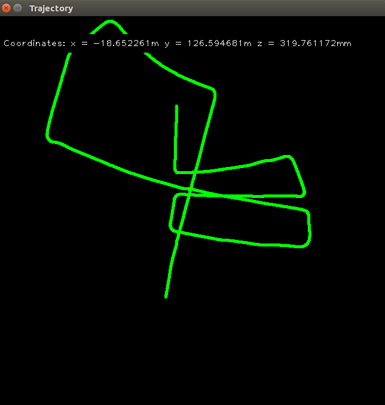

Monocular Visual Odometry using optical flow and Fast Feature detector

## Result On KITTI




## Run instructions

```bash
git clone
mkdir build
cd build 
cmake ..
make
./vo
```

## References
[1] (http://avisingh599.github.io/vision/monocular-vo/)


## License
MIT

